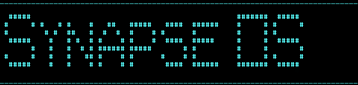

<center>Free and open source x86-64 operating system written in FASM and C</center>
<hr>

## 📕 Documentation
[Documentation](https://synapse-os.github.io/doc)

## 🔨 Build
To build SynapseOS you need to download the build tools [here](https://github.com/Synapse-OS/build-tools/releases)

After you have downloaded the build tools, you need to install the WSL with the ubuntu image, after installing it, you need to write the following command in the ubuntu terminal and wait for the process to complete:

```
sudo apt update
sudo apt-get install grub-common
sudo apt-get install xorriso
```

Next, unpack the downloaded archive into a separate folder and run one of the files, after starting they will ask you to provide the path to the project, you will just need to transfer the required folder to the console and press enter

---------------

# SynapseOS
SynapseOS это бесплатная open source x86-64 операционная система написанная на FASM и С

## 📕 Документация
[Документация](https://synapse-os.github.io/doc)

## 🔨 Сборка и запуск
Чтобы собрать систему вам понадобится скачать инструметы для сборки [здесь](https://drive.google.com/file/d/1E90V9DXx6-8ZoloeMgTTjUs0XCnLa2Bf/view?usp=sharing)

После того как вы скачали инструменты для сборки вам нужно будет установить WSL с официального сайта и установить на него образ ubuntu. Затем вам потребуется запустить WSL и выполнить следующие команды:

```
sudo apt update
sudo apt-get install grub-common
sudo apt-get install xorriso
```

Далее распакуйте скачаный архив с инструментами для сборки и запустите один из файлов. После запуска у вас откроется командная строка где потребуется ввсети путь до места сборки/запуска и нажать Enter
